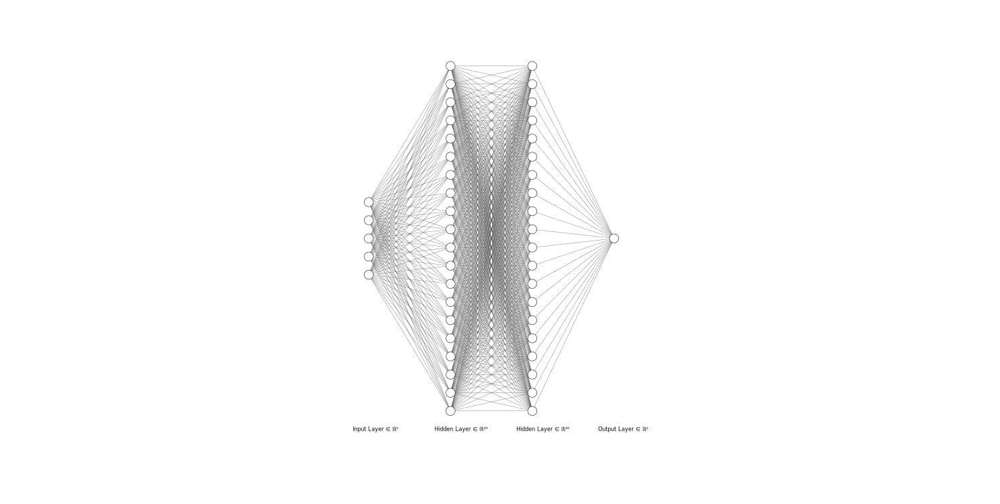

# Laranja ou Toranja
 
## Descrição
Esta é uma rede neural artificial capaz de dizer com 99% de certeza se uma fruta é uma toranja ou uma laranja com base em suas características...

## Instruções
Para instalar basta clonar esse repositório e dentro da pasta executar:

```
pip install requirements.txt 
```

Para rodar execute o arquivo src/programa.py

## Diagrama


## Dados
Você pode querer visualizar os dados clicando <a href="https://github.com/thiagopiassigit/Laranja-ou-Toranja/blob/main/src/dados.csv">aqui</a>